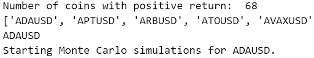
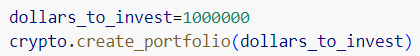
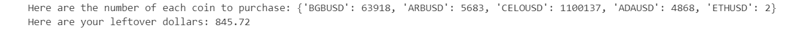
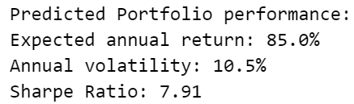

# Building the Perfect Crypto Portfolio

## Introduction:

Welcome to the Crypto Portfolio Optimization project – your go-to solution for crafting robust and high-performing cryptocurrency portfolios. Whether you're a seasoned investor or just stepping into the world of digital assets, our platform is designed to help you achieve the optimal balance between risk and return.This project leverages cutting-edge technologies and tools to deliver a comprehensive portfolio optimization experience. By utilizing the Bitfinex API, we seamlessly pull real-time cryptocurrency market data, providing you with up-to-date insights crucial for informed decision-making.

## What is the purpose of this tool:  
The purpose of our tool is to optimize a client's cryptocurrency portfolio, by taking information from the API Bitfinex and using this to calculate how much of each coin you should purchase and what type of returns you may expect to see. Portfolio optimization aims to maximize returns for a given level of risk. By optimizing your cryptocurrency holdings, you seek to achieve the highest possible returns based on your risk preferences. Portfolio optimization also allows you to adapt to changing market conditions. It enables you to adjust your holdings based on the evolving economic environment, market trends, and the performance of different assets.Optimization helps ensure that your portfolio is aligned with your chosen investment strategy as well, whether it's value investing, growth investing, or a specific trading approach.Optimizing also helps ensure that your capital is allocated efficiently, directing funds to assets with the potential for higher returns relative to their risk.

# DISCLAIMER!  
## This tool is for educational or informational purposes only and does not constitute financial advice.

Before investing in cryptocurrencies, individuals should conduct thorough research, understand the risks involved, and consider their risk tolerance and investment objectives. Diversification, risk management strategies, and staying informed about market developments are crucial aspects of managing these risks. It's advisable to consult with financial professionals for personalized advice based on individual circumstances.

**Version History:** Version: v.1.0.0

## Key features of the tool:

**1. Monte Carlo Simulations with MCForecastTools**
Harness the power of Monte Carlo simulations using the MCForecastTools library. Our platform empowers you to simulate various market scenarios, allowing you to visualize potential portfolio outcomes and make informed decisions based on a range of possible future market conditions.

**2.Advanced Portfolio Screening**
Our built-in screener efficiently filters through the vast array of cryptocurrencies, identifying promising opportunities while mitigating risks. Distinguish between the high-performing coins and those that may not align with your investment goals.

**3.Portfolio Optimization with PyPortfolioOpt**
Introducing the latest addition to our toolkit – **PyPortfolioOpt**. This library enables sophisticated portfolio optimization techniques, considering risk, return, and various constraints. Define your investment goals, set initial investment numbers, and let PyPortfolioOpt craft a tailored portfolio that aligns with your unique risk appetite.

## Installs and dependencies: 

**Clone the repository from github:** 
https://github.com/jbrunsell/Fintech-Project-3.git

To run the provided code, you'll need to install several Python libraries. You can install them using the following commands in your Python environment (you may use a virtual environment for better isolation): 

- **pip install pandas**
- **pip install MCForecastTools** 
- **pip install pypfopt**
- **pip install bitfinex-v2**
 

## What is our tool built on:
The **crypto_screener python** file is built for pulling all available cryptocurrencies denominated in USD and running Monte Carlo simulations on each and also creating a portfolio with the maximum Sharpe ratio.

### Inside the class Crypto_Screener are 5 constructors that make our tool work these are:

- **_init_ :** Constructs all the necessary files and attributes for the Crypto_Screener object.   
- **pull_crypto_data :** Pulls a list of all crypto tickers and then filters for only USD-denominated tickers and removes "TEST" tickers.  
- **import_crypto_data:** Imports CSV produced by pull_crypto_data and builds a MultiIndex dataframe containing all ticker data.  
- **run_crypto_sims:** Runs a simulation for each ticker based on # of years # of simulations input and builds a dataframe with the mean and median for each ticker's simulation.  
- **create_portfolio:** Utilizes the keepers ticker list and the original MultiIndex ticker dataframe to analyze and calculate a max Sharpe ratio portfolio and then outputs the correct number of each coin to purchase.

### These are the attributes used in the constructors :
- **lookback_days:** int, number of days for data to be pulled for all tickers denominated in USD.  
- **forced_tickers:** list(str), tickers that must be in the portfolio.  
- **sim_years:** int, number of years for simulation to predict.  
- **portfolio_size:** int, number of stocks to include in portfolio, (inclusive of forced) 

## How to use the tool:  

The module named **crypto_screener.py** is used by **crypto_screener_module_tester.ipynb** to run our tool.  

The tool is used by first unzipping the folder after downloading and then running the **crypto_screener_module_tester.ipynb**. After defining the screener to retrieve the coins we would like, the tool then pulls in all of the crypto data and screens it as well. The next step for our tool is to import the crypto data that was pulled in the previous step and use that data to run the simulations. 

After the simulations are complete the client will be able to input their desired investment amount:

The last step is for our tool to send back the results from all of the work it has done. The output will tell the client these things :

**1. The coin name and how much many shares to purchase:**
**2. Your leftover dollar amount:"**

**Predicted Portfolio Performance:**  
**1. Expected Annual Return:**  
**2. Annual Volatility:**  
**3. Sharpe Ratio:**

## How to read the output of the tool:  
The output generated by the tool is very easy to read, the name of the coin will appear on the left and next to it will be the percentage of that coin that should be purchased from your initial investment.

For example **('BGBUSD', 0.91506)** shows us the ticker **'BGBUSD'** and that **0.91506 percent** of our initial investment should go into that coin. After this step the tool will also show how many of the coins you should purchase by number by showing you the individual allocation. For example 'BGBUSD': 82001 shows us the ticker 'BGBUSD' and that we would need to purchase 82001 of those coins.

With this output you are ready to go and turn your dream portfolio into reality. Always remember that the market can change due to unforeseen circumstances and it is suggested that you use this tool in combination with your own research as well a consistent eye on the public knowledge of the market.Thanks for using our tool and happy trading!

## Whats Next?

**Some of the things we could do to further our project would be:**

- Testing likely returns in a Monte Carlo Simulation using the optimized portfolio. By doing this, we could further our research and optimize our portfolio even more.

- We would use a more sophisticated model that would allow us to further filter our coins, to lessen the strain as well as time spent running the program.

- Modify the portfolio generation tool to allow for the purchase of fractional coins to ensure the complete use of the initial investment.

- Add a monthly reminder to re-optimize the portfolio for comparison.

- Track our recommendations for each client and observe how their portfolio performs.
